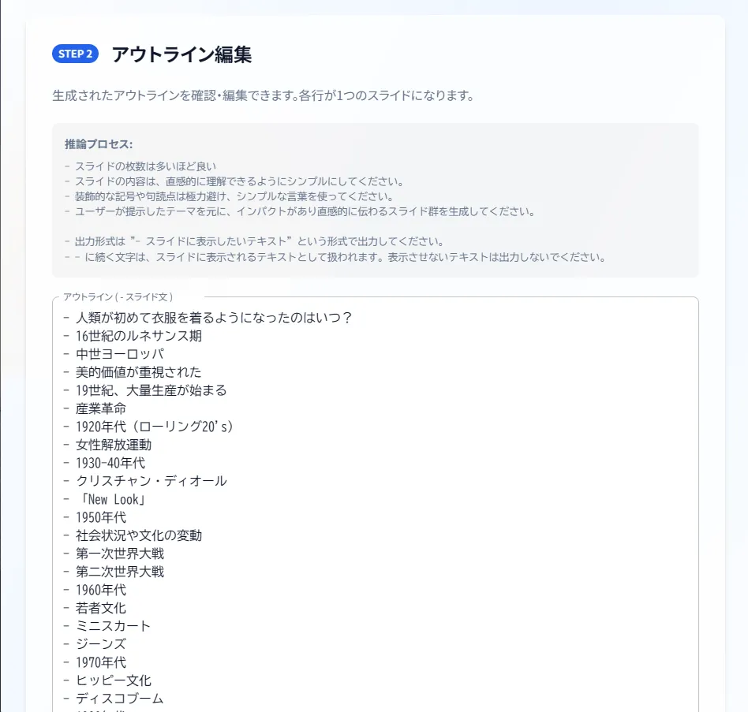

<div align="center">
  <h1>🎯 Takahashi Method Generator</h1>
  <p>
    <strong>ブラウザで完結する高橋メソッドプレゼンテーションジェネレーター</strong>
  </p>
  <p>
    <a href="#概要">概要</a> •
    <a href="#特徴">特徴</a> •
    <a href="#使い方">使い方</a> •
    <a href="#開発">開発</a> •
    <a href="#ライセンス">ライセンス</a>
  </p>
</div>

## 概要

Takahashi Method Generatorは、シンプルで効果的な[高橋メソッド](https://en.wikipedia.org/wiki/Takahashi_method)プレゼンテーションを簡単に作成できるWebアプリケーションです。テキストを入力するだけで、インパクトのあるプレゼンテーションスライドを自動生成します。





## 特徴

- 🚀 **ブラウザで完結**: インストール不要で、ブラウザ上で全ての操作が完結
- 🤖 **AIパワード**: ブラウザ内で動作するLLMを活用した自動生成
- 🎨 **モダンUI**: Material-UIとTailwindCSSによる美しいインターフェース
- 📱 **レスポンシブ**: あらゆるデバイスに最適化された表示
- 🔒 **プライバシー重視**: データはローカルで処理、外部サーバーに送信されません

## 使い方

1. [アプリケーション](http://localhost:3000)にアクセス
2. プレゼンテーションのアウトラインを入力
3. 生成ボタンをクリック
4. プレビューを確認して必要に応じて調整
5. 完成したプレゼンテーションを使用開始

## 開発

```bash
# リポジトリのクローン
git clone https://github.com/yourusername/takahashi-method-generator.git

# 依存関係のインストール
npm install

# 開発サーバーの起動
npm run dev

# ビルド
npm run build

# 本番サーバーの起動
npm run start
```

## 技術スタック

- [Next.js](https://nextjs.org/) - Reactフレームワーク
- [React](https://reactjs.org/) - UIライブラリ
- [Material-UI](https://mui.com/) - UIコンポーネント
- [TailwindCSS](https://tailwindcss.com/) - スタイリング
- [Web LLM](https://mlc.ai/web-llm/) - ブラウザ上でのLLM実行


## ライセンス

このプロジェクトはMITライセンスの下で公開されています。詳細は[LICENSE](LICENSE)ファイルをご覧ください。

---

<div align="center">
  Made with ❤️ for presentations
</div>
